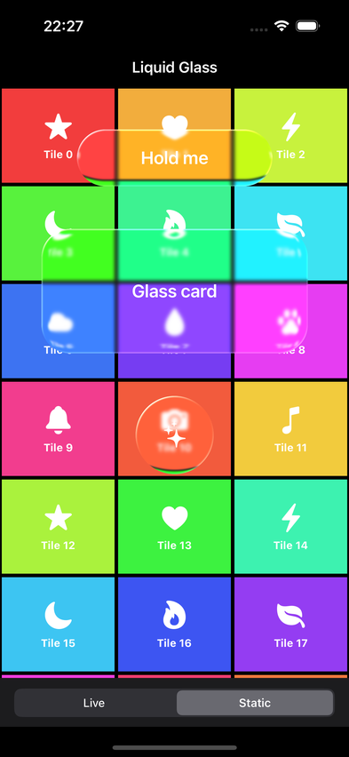
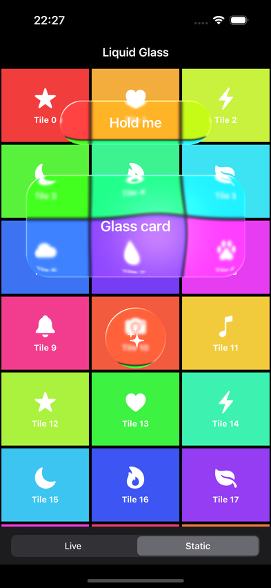
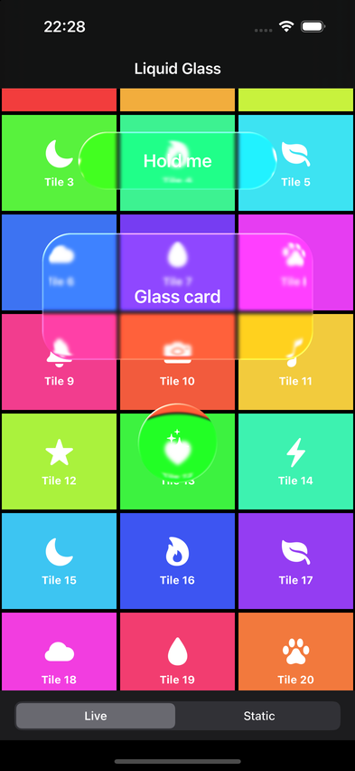

# LiquidGlass

A liquid glass view for UIKit, rendered with Metal. It refracts whatever is behind it, bends content around its edges, and reacts to touch with a spring. It runs on iOS 17 and later and looks the same on every version, including iOS 26.

| Static | Pressed | Live, after scrolling |
|---|---|---|
|  |  |  |

## Features

- Edge refraction. The rim pulls in content from just past the edge, so lines and icons bend around the shape.
- Press response. The view scales up on a spring, bulges the content under the finger, glows at the touch point, and wobbles back on release. The bulge follows the finger while it drags.
- Blur, tint, saturation, chromatic aberration, a specular rim highlight and opacity, all set through one `LiquidGlassStyle` value.
- Capsule, rounded rectangle and circle shapes, anti-aliased in the shader.
- Live or static backdrop. Live re-captures every frame for scrolling or animated content. Static captures once and renders nothing until something changes.
- Accessibility. Reduce Transparency switches to a solid fill. Reduce Motion skips the press scale.
- No dependencies. The package is UIKit, Metal, MetalKit and Metal Performance Shaders.

## Requirements

- iOS 17.0+. Runs on the iOS 18.6 and 26.5 simulators. iOS 17 builds but has not been run yet.
- Xcode 16+ (Swift tools 6.0, Swift 5 language mode). Built and tested with Xcode 27.

## Installation

Swift Package Manager:

```swift
dependencies: [
    .package(url: "https://github.com/alexey-savchenko/LiquidGlass.git", from: "1.2.0")
]
```

Then add `"LiquidGlass"` to your target's dependencies. In Xcode, use File > Add Package Dependencies and paste the repository URL.

## Quick start

```swift
import LiquidGlass

let glass = LiquidGlassView()
glass.style.shape = .capsule
glass.backdrop = .live                 // the content behind scrolls

let label = UILabel()
label.text = "Hold me"
glass.contentView.addSubview(label)    // put labels and icons in contentView

glass.addAction(UIAction { _ in print("tapped") }, for: .primaryActionTriggered)
view.addSubview(glass)                 // above the content it should refract
```

Two rules matter.

1. The glass refracts whatever is behind it in its superview. While it captures, it hides itself and every view stacked above it, so it never sees its own output or the views on top of it. To refract a different view, set `sourceView`.
2. Choose the backdrop to match the content. Use `.live` when the content behind moves. Use `.static` when it does not, and call `setNeedsBackdropUpdate()` after you change that content.

## Configuration

`LiquidGlassStyle` holds every visual parameter. Start from a preset and change what you need.

```swift
var style = LiquidGlassStyle.regular
style.shape = .roundedRect(cornerRadius: 32)
style.tint = UIColor.systemBlue.withAlphaComponent(0.15)
style.refraction = 1.2
glass.style = style
```

| Property | Default (`.regular`) | Meaning |
|---|---|---|
| `shape` | `.capsule` | `.capsule`, `.roundedRect(cornerRadius:)` or `.circle` |
| `tint` | white, alpha 0.10 | Color mixed over the glass. Its alpha is the tint strength. |
| `blurRadius` | 2 | Gaussian blur of the backdrop, in points |
| `refraction` | 0.9 | Edge bend strength. The rim shifts content by up to `refraction × bezelWidth` points. |
| `bezelWidth` | 16 | Width of the refracting rim, in points |
| `chromaticAberration` | 0.06 | Red and blue split along the refracted rim |
| `saturation` | 1.4 | 1 leaves colors as they are. Higher values make them more vivid. |
| `highlight` | 0.8 | Strength of the specular rim light (light comes from the top left) |
| `opacity` | 1 | Overall alpha of the glass |

`.clear` is a second preset. It has no tint and no blur, and it uses a wider, stronger rim.

## API

| Symbol | Description |
|---|---|
| `LiquidGlassView` | `UIControl` subclass. Sends `.primaryActionTriggered` on touch up inside. |
| `contentView` | Container for your labels and icons, drawn above the glass |
| `sourceView` | Optional weak reference to the view to refract. When `nil` (the default), the glass refracts its superview. |
| `style` | The `LiquidGlassStyle` in use. Setting it re-renders. |
| `backdrop` | `.live` or `.static` (the default) |
| `setNeedsBackdropUpdate()` | Re-capture on the next frame in static mode |

## Example app

`Example/LiquidGlassExample.xcodeproj` shows a capsule, a card and a circle over a scrolling color grid, with a Live / Static switch. Open it, pick an iOS 17+ simulator and run it. It uses the package from the repository root.

## How it works

Every frame that needs drawing goes through the same steps.

1. Hide the glass and the views above it, then render the source (the superview, or `sourceView` if set) into a GPU-shared pixel buffer with `layer.render(in:)`. Only the region under the glass is drawn, plus a margin for the refraction.
2. Blur the result with Metal Performance Shaders.
3. Draw one fragment pass. It computes the shape's distance field, refracts the rim, applies the press bulge, tint, saturation, rim light and touch glow, and anti-aliases the edge.

The render loop runs only while it has work to do, meaning live mode or a spring still moving. A static glass at rest costs nothing per frame.

Details are in [docs/architecture.md](docs/architecture.md) and [docs/shader.md](docs/shader.md).

## Limitations

- `layer.render(in:)` draws the model layer tree. It cannot capture `UIVisualEffectView` blurs, `AVPlayerLayer` video, other Metal or `CAMetalLayer` content (including other glass views), or animations in flight. These show as blank or frozen under the glass.
- Live mode captures on the main thread every frame. Keep live glass views small and few, and profile on a device. The `LiquidGlass` signpost category marks each capture and encode interval in Instruments.
- In static mode, a glass that moves without resizing keeps its old capture until you call `setNeedsBackdropUpdate()`.
- The shader assumes an opaque backdrop. Transparent areas of the source darken under the glass.
- With the superview as the source, each capture walks the superview's whole layer tree. Only the area under the glass is drawn, but a superview with many layers costs more. Set `sourceView` to a smaller view to narrow it.

## Testing

```bash
xcodebuild -scheme LiquidGlass -destination 'platform=iOS Simulator,name=iPhone 16' test
```

The tests cover spring settling and overshoot, the capture rectangle (margin, clipping, transforms, scroll offset), the superview fallback and which views are hidden during capture, when the render loop runs, and the uniform buffer layout. The layout test checks the Swift struct against the compiled shader through pipeline reflection.

## License

MIT. See [LICENSE](LICENSE).
