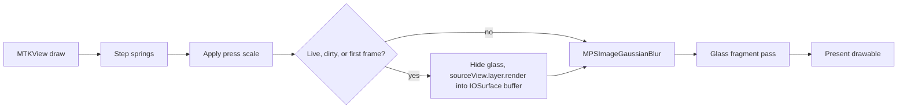

# Architecture

This page describes how `LiquidGlassView` gets pixels from behind itself onto the GPU, when it renders, and how the press response works.

## Files

| File | Responsibility |
|---|---|
| `Sources/LiquidGlass/LiquidGlassView.swift` | Public API: `LiquidGlassStyle`, `LiquidGlassView`, touch tracking, the springs and the render loop |
| `Sources/LiquidGlass/LiquidGlassRenderer.swift` | Metal device, pipeline, texture cache, backdrop capture, blur and the draw call |
| `Sources/LiquidGlass/Shaders/LiquidGlass.metal` | Vertex and fragment shaders. See [shader.md](shader.md). |

## Why the backdrop is captured

Metal cannot read the pixels behind a view. The obvious alternatives all fall short.

| Option | Why it does not work here |
|---|---|
| SwiftUI `layerEffect` | It samples only the layer it modifies, so it cannot see UIKit content behind it. |
| `CABackdropLayer` (private) | It supplies a live backdrop but runs only Core Animation filters, not custom shaders. |
| `drawHierarchy(in:afterScreenUpdates: false)` | It reads the last committed frame, which already contains the glass, so the glass would refract itself. |
| `UIGlassEffect` (iOS 26) | It does not exist before iOS 26 and cannot be customized. |

So the view renders a source view it is given (`sourceView`) into a buffer itself.

## Frame pipeline



### Capture

- The capture rectangle is the glass frame converted into `sourceView` coordinates with `convert(bounds, to:)`, so it follows the press transform. It is outset by `refraction × bezelWidth` points, clipped to `sourceView.bounds` and snapped to the pixel grid.
- `layer.render(in:)` ignores a scroll view's `bounds.origin`, so the rectangle stays in content coordinates and the context translates by its origin.
- The view sets `isHidden = true` on itself, renders and restores. No Core Animation commit happens in between, so nothing flickers.
- Pixels go into an IOSurface-backed BGRA `CVPixelBuffer` with a `CGContext` bound to its memory. `CVMetalTextureCache` exposes the same memory as an `MTLTexture`, so nothing is copied.
- Three buffers rotate. A buffer is reused only once the GPU has finished with it, which an in-flight counter tracks from the command buffer's completion handler. One buffer would let the CPU overwrite a frame the GPU is still reading.
- Buffers are re-created only when the capture size changes.

### Blur

`MPSImageGaussianBlur` with sigma `blurRadius × screen scale` writes into a private texture. It runs once per capture, not once per frame.

### Draw

One full-screen triangle, one fragment pass, premultiplied alpha into a transparent `MTKView`. The uniforms are passed with `setFragmentBytes`.

## Render loop

`MTKView` drives the frames, so there is no separate `CADisplayLink`. One derived property decides whether it runs.

```swift
var needsFrames: Bool {
    window != nil && ((backdrop == .live && !usesSolidFill) || !isMotionSettled)
}
```

- The loop is paused (`isPaused = true`) whenever `needsFrames` is false.
- In static mode at rest, a change (layout, style, `setNeedsBackdropUpdate()`, moving to a window) schedules exactly one `draw()`.
- A view that is not in a window never renders.

## Press response

`LiquidGlassView` is a `UIControl`. Its tracking methods drive three springs.

| Spring | Stiffness | Damping | Drives |
|---|---|---|---|
| `press` | 380 | 20 | 0 at rest, 1 while held. Sets the scale (`1 + 0.06 × press`), the extra rim refraction, the bulge and the glow. |
| `touchX`, `touchY` | 220 | 16 | The touch point, which trails the finger while it drags |

The springs integrate at 240 Hz substeps inside each frame, so they behave the same at 60 Hz and 120 Hz. The release is underdamped and dips about 15% past rest once before it settles. When a spring is within tolerance it snaps exactly to its target, and the loop can stop.

`.primaryActionTriggered` fires when the touch ends inside the bounds.

## Accessibility

- With Reduce Transparency on, the Metal view is hidden and the glass shows a solid fill. The fill is the opaque tint if the tint alpha is at least 0.5, otherwise `secondarySystemBackground`. The view listens for the status change notification.
- With Reduce Motion on, the press scale is skipped. The shader response (bulge and glow) still plays.

## Shared GPU state

The Metal device, command queue, pipeline state and texture cache are created once, in `GlassGPU.shared`, and shared by every glass view. Each view owns its own capture buffers and blur texture.
