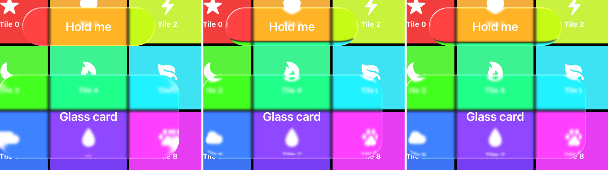

# Shader

`Sources/LiquidGlass/Shaders/LiquidGlass.metal` holds one vertex shader and one fragment shader. Xcode compiles it into the package's resource bundle, and the renderer loads it with `makeDefaultLibrary(bundle: .module)`.

## Uniforms

`GlassUniforms` is mirrored in Swift and MSL. It uses only 16-byte `float4` rows, so both languages lay it out the same way, 112 bytes in total. A unit test checks the Swift stride against the compiled shader's buffer size through pipeline reflection. If you add a field, add a whole `float4` and update both sides.

| Row | `.x` | `.y` | `.z` | `.w` |
|---|---|---|---|---|
| `tint` | red | green | blue | tint strength |
| `capture` | capture origin x | capture origin y | capture width | capture height |
| `mapping` | glass origin x in source | glass origin y in source | transform scale | press, 0 to 1 |
| `touch` | touch x | touch y | bulge radius | bulge strength |
| `shape` | width | height | corner radius | bezel width |
| `optics` | refraction | chromatic aberration | saturation | highlight |
| `finish` | opacity | unused | unused | unused |

All lengths are in points. The capture and mapping rows are in `sourceView` coordinates. Touch and shape are in the glass's own coordinates.

## Vertex stage

The vertex stage emits a full-screen triangle from `vertex_id`. It needs no vertex buffer, and the UV runs from 0 to 1 over the view.

## Fragment stage

For each pixel, `local = uv × size`, and `p` is that position relative to the center.

### Shape and anti-aliasing

```metal
float distance = roundedBoxDistance(p, halfSize, radius);   // < 0 inside
float coverage = 1.0 - smoothstep(-0.5 * pixel, 0.5 * pixel, distance);
```

A rounded-rectangle signed distance field covers all three shapes. A capsule and a circle are rounded rectangles whose corner radius is half the short side. `fwidth` gives the pixel size, so the edge is one pixel wide at any scale.

### Edge refraction

```metal
float2 gradient = outwardGradient(p, halfSize, radius);     // unit normal, pointing out
float rimDepth = 1.0 - clamp(-distance / bezel, 0.0, 1.0);  // 1 at the edge, 0 at the inner bezel line
float2 refracted = gradient * thickness * rimDepth * rimDepth;
```

The gradient of the distance field is the surface normal, found by central differences. Inside the bezel, each pixel samples outward along that normal. The offset is at most `thickness = refraction × bezelWidth` at the edge and falls off as the square of the distance to the inner bezel line. The rim therefore shows a compressed view of the region just outside the glass. Lines that cross the edge bend around the corners, and content beside the edge slides into the rim. The capture margin is exactly `thickness`, so these samples exist.

### Why outward

Five rim models were compared on the same frame.



From left to right: inward along the normal, outward with a squared falloff (the one shipped), outward with a circular falloff.

| Model | Result |
|---|---|
| Inward along the normal | Barely visible. Each 16 pt rim shows about 1.6 pt of content, stretched into flat color. |
| Snell's law `refract()`, inward | Looks the same as the inward normal model |
| Radial lens toward the center | Offsets run along the radius, not the edge normal, so the long edges smear into dark bands. |
| Outward, `(1 - t)²` falloff | Content visibly bends into the rim. Shipped. |
| Outward, circular falloff | The bend is packed into the last pixel or two. |

### Press bulge

```metal
float2 toTouch = local - u.touch.xy;
float touchFalloff = 1.0 - smoothstep(0.0, radius, length(toTouch));
float2 bulge = -toTouch * strength * press * touchFalloff * touchFalloff;
```

Pixels near the touch point sample closer to it, which magnifies the content under the finger. The effect fades smoothly to zero at the bulge radius, which is 0.9 × the short side and at least 44 pt. The press also raises the rim refraction by 10%.

### Sampling and chromatic aberration

The shader samples each color channel separately. Red uses `1 + aberration` times the refraction offset, green 1×, and blue `1 - aberration`. Each sample point is mapped from glass coordinates to source coordinates (`mapping`) and then to capture UVs (`capture`). The sampler clamps to the edge, so a sample just past the margin repeats the edge pixel rather than going black.

### Color

1. Saturation mixes between Rec. 709 luma and the sample (`saturation` = 1 changes nothing).
2. The tint is mixed in by its alpha.
3. The rim light is added. A 2.5 pt band at the edge is lit by `dot(normal, light)²` from the top left, plus 40% from the opposite side. This is scaled by `highlight`.
4. The touch glow is added, `0.22 × press × touchFalloff²`.

### Output

The color is clamped and multiplied by `coverage × opacity`, and the shader returns premultiplied alpha to match the transparent `MTKView`.
